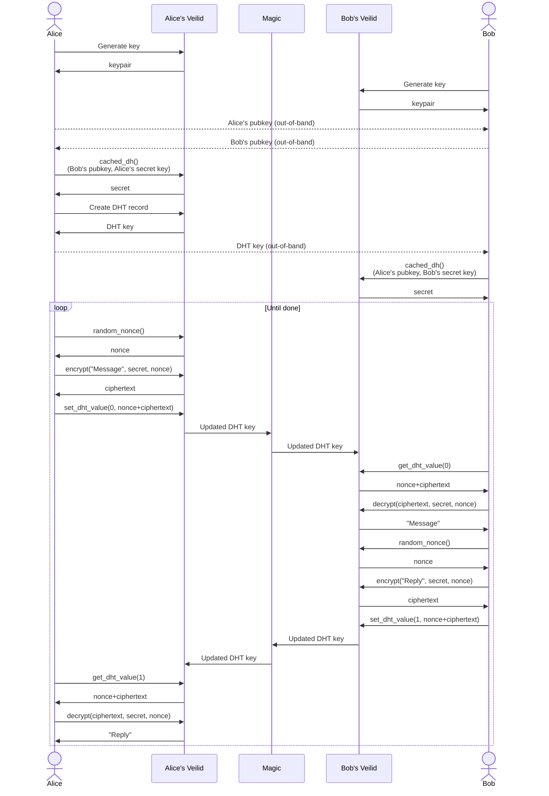

# A simple Veilid DHT chat demo

Thanks for reading! This chat program is meant to be a simple, readable demonstration of how to communicate with Veilid. A real chat program would not look like this:

- A lot of code is duplicated. This was on purpose so that each function would be readable and understandable without having to trace through lots of helper functions.
- The user interface is too simple. If you're halfway through typing a message when your app receives one from the other party, the inbound message will make a mess of your screen.
- The messaging flow is too simple. If you send messages faster than the other party can receive them, some of your messages old will get overwritten by new ones.
- Users have to trade their public keys, and even the chat's DHT key, through another channel like SMS.

But then, the major portions of a real app wouldn't fit on a single screen. This demo just shows how all the moving parts fit together. Your challenge is to take them and build something better!

## Installation

1. Install [poetry](https://python-poetry.org) if you haven't already.
2. Run `poetry install`

## Usage

First, run `veilid-server`. This demo tries to connect to localhost port 5959 by default. You can override that with the `--host` and `--port` arguments.

Create your cryptographic keypair:

```console
$ poetry run chat keygen
Your new public key is: d3aDb3ef
Share it with your friends!
```

_Note: This writes your new private key to a file called `.demokeys`. Don't do that in your app!_

Copy the public key and send it to a friend you want to chat with. Have your friend do the same.

Now, add your friend's public key to your keyring:

```console
$ poetry run chat add-friend MyFriend L0nGkEyStR1ng
```

To start a chat with that friend:

```console
$ poetry run chat start MyFriend
New chat key: VLD0:abcd1234
Give that to your friend!
SEND>
```

Copy that chat key and send it to your chat partner. They can respond to your chat:

```console
$ poetry run chat respond CoolBuddy VLD0:abcd1234
SEND>
```

Now you can send simple text messages back and forth. Your messages are encrypted and transmitted through a distributed hash table (DHT), passed through an open-source, peer-to-peer, mobile-first networked application framework. Neat!

Remember that this simplified program can only receive a message when it's not waiting for you to enter one.

## Sequence diagram

Here's how the program generates keys, uses the Diffie-Hellman (DH) algorithm to calculate shared keys, reads from and writes to the DHT, and uses encryption with nonces to secure messages in the public network.

<!--use:mermaid-->



(Tip: read the text of this file to see more comments!)
